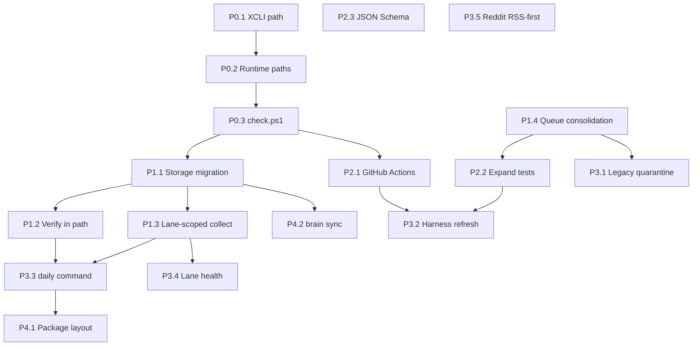

# Cursor Improvement Execution Plan

**Branch:** `cursor-improvement-plan`  
**Created:** 2026-06-11  
**Scope:** Plan only — no implementation in this document  
**Source:** Post-improvement review issues (P0–P4), `.harness/PROGRESS.md`, `AGENTS.md`, `Makefile`, `references/script-inventory.md`, `references/data-storage.md`

---

## Executive Summary

X Distribution has a working Phase 1 collection pipeline, protected queue seam (`scripts/intelligence_queue.py`), master CLI (`scripts/x_distribution.py`), and schema validation — but **operator reliability on Windows is blocked** by a missing pinned XCLI path, **config drift** between `config/runtime_paths.json` and `config/source_registry.json`, and **no native `make check` equivalent** in PowerShell.

This plan sequences 17 review issues across five priority phases. Each phase ends with explicit verification gates (`make check` or `scripts/check.ps1` equivalent). **Implementation follows WIP=1:** one write-capable subagent at a time; read-only explore/shell audits may run in parallel within a wave.

**Estimated delivery:** 8–12 agent sessions across 6 execution waves (Wave 0 recon + P0–P4).  
**Total subagent invocations:** **31** (8 explore + 17 generalPurpose write + 6 shell verify).

---

## Current Baseline (from harness state)

| Area | Status |
|------|--------|
| Python compile + contract tests | Pass (`Makefile` `test` target) |
| Schema validation | Pass (`scripts/validate_schemas.py`) |
| Route checks | **Fail** — missing `C:\Users\Manit\Desktop\Twitter automation\cli.py` |
| `make` on Windows PowerShell | Not installed; operators must run Python commands manually |
| Storage layout dirs | Created via `storage-check`; **writers still use legacy flat `data/` paths** |
| Verification in default path | `verify` exists but is not wired into `collect` / daily flow |
| CI | No `.github/workflows/` |
| `feature_list.json` | Stale (`last_updated: 2026-06-01`); missing P0–P4 improvement features |

---

## Phase P0 — Reliability (blocks all green `check`)

**Goal:** Restore route checks and give Windows operators a one-command health gate.

### P0.1 — Fix and document pinned XCLI path

| Field | Detail |
|-------|--------|
| **Problem** | `config/source_registry.json` and `config/runtime_paths.json` pin `default_xcli_script` to a path that does not exist on this machine. `scripts/x_distribution.py routes` fails. |
| **Files** | `config/runtime_paths.json`, `config/source_registry.json`, `scripts/source_clis.py`, `scripts/validate_schemas.py`, `references/config-schemas.md`, `AGENTS.md`, `.harness/PROGRESS.md` |
| **Tasks** | 1) Locate or restore valid XCLI (`cli.py`) or document env override (`XCLI_SCRIPT`). 2) Make `runtime_paths.json` the single runtime authority; remove duplicate `runtime_paths` block from `source_registry.json` (or mark deprecated with loader-only merge). 3) Add `references/xcli-setup.md` with path resolution order: env → `runtime_paths.json` → fail-closed message. 4) Update `PROGRESS.md` Known Issues when resolved. |
| **Acceptance** | `python scripts/x_distribution.py routes` exits 0; `source_clis.py` prints resolved XCLI and YT paths; schema validation reports no missing `runtime_paths` keys. |

### P0.2 — Unify runtime path configuration

| Field | Detail |
|-------|--------|
| **Problem** | Drift: `source_registry.json` lists `default_yt_transcript_cli: scripts/yt_transcript_cli.py` while `runtime_paths.json` lists `C:\Users\Manit\bin\yt-transcript.cmd`. |
| **Files** | `config/runtime_paths.json`, `config/source_registry.json`, `scripts/source_registry.py`, `scripts/source_clis.py`, `docs/adr/0005-portable-configurations-and-failsafe-cli.md` |
| **Tasks** | 1) Enforce merge order documented in ADR-0005: `DEFAULT_REGISTRY` → `source_registry.json` (non-path keys only) → `runtime_paths.json` (wins for paths). 2) Strip path keys from `source_registry.json` or add validation warning if duplicated. 3) Add unit test asserting YT and XCLI resolution matches `runtime_paths.json`. |
| **Acceptance** | Single resolved path per CLI; no conflicting values after `load_registry()`; new test in `scripts/test_source_registry_paths.py` passes. |

### P0.3 — Windows-native check script

| Field | Detail |
|-------|--------|
| **Problem** | `make check` unavailable in PowerShell; operators skip validation. |
| **Files** | `scripts/check.ps1` (new), `Makefile`, `AGENTS.md`, `README.md` |
| **Tasks** | 1) Create `scripts/check.ps1` mirroring `make check`: compile, run contract tests, `validate`, `routes`. 2) Use pinned Python from `runtime_paths.json` or `$env:X_DISTRIBUTION_PYTHON` with fallback to `sys.executable` discovery. 3) Document in `AGENTS.md` Quick Start. |
| **Acceptance** | `powershell -File scripts/check.ps1` exits 0 when routes fixed; non-zero on failure; output lists each step. |

**P0 verification gate**

```powershell
powershell -File scripts/check.ps1
# or: make check (where make exists)
```

Record result in `.harness/verification_results.json`.

---

## Phase P1 — Architecture / Pipeline

**Goal:** Complete storage migration shims, wire verification into the operator path, enable lane-scoped collection, and close remaining queue write bypasses.

**Depends on:** P0 complete (routes + check script).

### P1.1 — Finish storage migration (`data/raw/`, `normalized/`, `verified/`)

| Field | Detail |
|-------|--------|
| **Problem** | `storage-check` creates target dirs; collectors still write flat `data/*.json`. |
| **Files** | `config/source_registry.json` (path map), `scripts/source_registry.py`, `scripts/phase1_collect.py`, per-lane collectors (`*_standalone.py`, `finance_market_collector.py`, etc.), `references/data-storage.md`, `data/storage_layout_manifest.json` |
| **Tasks** | 1) Add `storage_paths` section to registry mapping legacy → target paths per lane. 2) Update writers to dual-write (legacy + new) for one release cycle. 3) Update readers (`intelligence_queue.py`, aggregators) to prefer new paths with legacy fallback. 4) Document safe migration order (already in `data-storage.md`). |
| **Acceptance** | After `collect --verify-only` + one bounded collect, items appear under `data/raw/<lane>/`; `data/normalized/news_queue.json` or shim reads match legacy counts; `storage-check` manifest lists migrated outputs. |

### P1.2 — Wire verification into default operator path

| Field | Detail |
|-------|--------|
| **Problem** | `x_distribution.py verify` is separate from `collect`; fact-check / corroboration not in daily flow. |
| **Files** | `scripts/x_distribution.py`, `scripts/phase1_collect.py`, verification modules (`truth_oracle.py`, `reverify_news.py`, Polymarket hooks), `references/fact-checking.md` |
| **Tasks** | 1) Add `--verify` flag to `collect` (post-collection schema + optional claim reverify). 2) Or add `collect-and-verify` subcommand. 3) Ensure verify never auto-posts (manual-copy only per AGENTS.md #9). |
| **Acceptance** | `python scripts/x_distribution.py collect --verify-only` unchanged; full path `collect` + verify writes harness result with `status: passed`; no X post/reply side effects. |

### P1.3 — Incremental / lane-scoped collection

| Field | Detail |
|-------|--------|
| **Problem** | Full Phase 1 collect touches all lanes; slow and brittle when one lane fails. |
| **Files** | `scripts/phase1_collect.py`, `scripts/source_registry.py`, `config/source_registry.json`, `scripts/x_distribution.py` |
| **Tasks** | 1) Add `--lanes` / `--skip-lanes` CLI (e.g. `x,youtube,reddit,finance`). 2) Registry exposes lane → script mapping. 3) Lane health summary at end of run. |
| **Acceptance** | `collect --lanes reddit,hn` runs only those collectors; queue merge still works; other lane files untouched or explicitly skipped in log. |

### P1.4 — Consolidate queue mutation entry points

| Field | Detail |
|-------|--------|
| **Problem** | Multiple scripts can mutate queue (`phase1_collect.py`, `aggregate_*.py`, `flash_hunt.py`, `merge_breadth.py`, etc.). |
| **Files** | `scripts/intelligence_queue.py`, `scripts/aggregate_deep_discovery.py`, `scripts/aggregate_news.py`, `scripts/final_hybrid_aggregator.py`, `scripts/flash_hunt.py`, `scripts/merge_breadth.py`, `scripts/queue_maintenance.py`, `scripts/collection_adapter.py` |
| **Tasks** | 1) AST audit for direct `news_queue.json` writes (extend F14 audit). 2) Route all canonical mutations through `intelligence_queue.py`. 3) Mark legacy aggregators as read-only or thin wrappers. |
| **Acceptance** | Audit finds 0 direct write-mode opens to `data/news_queue.json` outside `intelligence_queue.py`; contract tests pass. |

**P1 verification gate**

```powershell
powershell -File scripts/check.ps1
python scripts/x_distribution.py storage-check
python scripts/x_distribution.py collect --verify-only
python scripts/x_distribution.py collect --lanes reddit --skip-x
python scripts/test_intelligence_queue.py
```

---

## Phase P2 — Testing / CI

**Goal:** Automated regression safety on push/PR and stronger schema guarantees.

**Depends on:** P0 (check script); P1.4 recommended before expanding test surface.

### P2.1 — GitHub Actions CI

| Field | Detail |
|-------|--------|
| **Files** | `.github/workflows/check.yml` (new), `scripts/check.ps1`, `Makefile`, `AGENTS.md` |
| **Tasks** | 1) Workflow on `push`/`pull_request` to `main`. 2) Windows job: Python 3.11, `make test` + `validate` (routes step `continue-on-error` or mocked XCLI until P0 fixed on CI). 3) Document CI limitations for XCLI/YT (secrets/paths). |
| **Acceptance** | CI runs compile + contract tests + schema validate; badge-ready; fails on test regression. |

### P2.2 — Expand tests (collectors, phase1, milestone3 recovery)

| Field | Detail |
|-------|--------|
| **Files** | `scripts/test_intelligence_queue.py`, `scripts/test_milestone3_recovery.py`, new `scripts/test_phase1_collect.py`, `scripts/test_source_registry_paths.py`, collector smoke tests, `Makefile` |
| **Tasks** | 1) Phase1 unit tests with mocked subprocess collectors. 2) Collector output shape tests per lane. 3) Wire `test_milestone3_recovery.py` into `make test`. 4) Reddit RSS-first fallback test (mock 403 on JSON). |
| **Acceptance** | `make test` / `check.ps1` runs ≥12 contract tests; all pass without live network where mocked. |

### P2.3 — JSON Schema validation (formal)

| Field | Detail |
|-------|--------|
| **Files** | `schemas/` (new), `scripts/validate_schemas.py`, `references/config-schemas.md`, `config/*.json` |
| **Tasks** | 1) Extract JSON Schema files for registry, queue, lane outputs. 2) Validate via `jsonschema` library alongside existing practical checks. 3) Keep backward-compatible warnings for legacy queue shape. |
| **Acceptance** | `validate` runs both practical + JSON Schema; 0 errors on current data; schemas versioned in `schemas/`. |

**P2 verification gate**

```powershell
powershell -File scripts/check.ps1
# Local: gh act or push to branch and confirm workflow green
```

---

## Phase P3 — Maintainability

**Goal:** Reduce operator cognitive load, quarantine legacy scripts, refresh harness tracking, improve observability.

**Depends on:** P1 operator path; P2 CI recommended.

### P3.1 — Archive / quarantine legacy scripts

| Field | Detail |
|-------|--------|
| **Files** | `scripts/archive_stale_files.py`, `config/source_registry.json` (`stale_file_policy`), `references/script-inventory.md`, move candidates to `scripts/legacy/` or gate with explicit `--legacy` flag |
| **Tasks** | 1) Quarantine scripts listed under "Legacy Or Archive Candidates" in script inventory. 2) Update imports/routes so master CLI does not invoke them by default. 3) Dry-run archive pass. |
| **Acceptance** | `script-inventory.md` matches tree; `check.ps1` passes; no default collect path calls `process_news.py` or NoteGPT-primary flows. |

### P3.2 — Refresh harness metadata

| Field | Detail |
|-------|--------|
| **Files** | `.harness/feature_list.json`, `.harness/features.md`, `.harness/PROGRESS.md`, `.harness/session_state.json` |
| **Tasks** | 1) Add features F17–F24 for P0–P3 work. 2) Mark completed with evidence links. 3) Set WIP=1 active feature pointer. |
| **Acceptance** | `feature_list.json` `last_updated` current; one `in_progress` max. |

### P3.3 — Single daily operator command

| Field | Detail |
|-------|--------|
| **Files** | `scripts/x_distribution.py` |
| **Tasks** | 1) Add `daily` subcommand: `storage-check` → lane-scoped or full `collect` → `normalize` → `validate` → `verify` (optional `--skip-x`, `--lanes`). 2) Write single harness verification entry. |
| **Acceptance** | `python scripts/x_distribution.py daily --skip-x` completes end-to-end; documented in `AGENTS.md`. |

### P3.4 — Lane health observability in CLI / dashboard

| Field | Detail |
|-------|--------|
| **Files** | `scripts/phase1_collect.py`, `scripts/x_distribution.py`, `scripts/generate_dashboard.py`, `data/raw/status/` or `logs/agent_runs/` |
| **Tasks** | 1) Persist per-lane status JSON (ok/degraded/failed/skipped, duration, last error). 2) Expose `x_distribution.py status` or dashboard panel. |
| **Acceptance** | After collect, operator can see lane health without reading full logs; statuses survive rerun. |

### P3.5 — Reddit RSS-first strategy

| Field | Detail |
|-------|--------|
| **Files** | `scripts/reddit_mcp_buddy_collect.py`, `config/community_sources.json`, `references/script-inventory.md` |
| **Tasks** | 1) Default order: RSS → MCP probe (opt-in) → legacy JSON preservation. 2) Config flag `reddit_strategy: rss-first`. 3) Log when MCP skipped due to policy. |
| **Acceptance** | Reddit collect succeeds without MCP when RSS available; 403 on JSON does not block lane; test covers ordering. |

**P3 verification gate**

```powershell
python scripts/x_distribution.py daily --skip-x --lanes reddit,hn
powershell -File scripts/check.ps1
```

---

## Phase P4 — Longer Term

**Goal:** Package structure and data-repo automation without breaking local Windows workflow.

**Depends on:** P1 storage paths; P3 daily command.

### P4.1 — Python package layout

| Field | Detail |
|-------|--------|
| **Files** | New `src/x_distribution/` or `x_distribution/` package, `pyproject.toml`, shim `scripts/*.py` wrappers, `AGENTS.md` |
| **Tasks** | 1) Move core modules (`source_registry`, `source_clis`, `intelligence_queue`) into importable package. 2) Keep `scripts/` as thin CLI entrypoints for backward compatibility. 3) No mass data move in same PR. |
| **Acceptance** | `pip install -e .` optional; `check.ps1` still passes; imports work from package and legacy script paths. |

### P4.2 — Data repo sync automation (xdist-brain)

| Field | Detail |
|-------|--------|
| **Files** | New `scripts/sync_brain.py`, `config/brain_sync.json`, docs referencing ADR brain separation |
| **Tasks** | 1) Define sync manifest (transcripts, raw lane outputs, reports — not code). 2) Push/pull automation with dry-run; respect protected queue policy. 3) Document manual approval before sync. |
| **Acceptance** | `sync_brain.py --dry-run` lists files; no code/config copied to brain remote; operator doc in `references/data-storage.md`. |

**P4 verification gate**

```powershell
powershell -File scripts/check.ps1
python scripts/sync_brain.py --dry-run
```

---

## Subagent Orchestration

### Rules

1. **WIP=1 for writes:** Only one `generalPurpose` implementation subagent may modify the repo at a time.
2. **Parallel read-only:** `explore` and read-only `shell` subagents may run in parallel within the same wave.
3. **Verification between waves:** Parent agent runs `check.ps1` (or documents failure in `PROGRESS.md`) before starting the next wave.
4. **No auto-posting:** All subagents must respect AGENTS.md #9 — artifacts only.
5. **Protected data:** Do not delete `data/news_queue.json`, transcripts, or verification ledgers; use `archive_stale_files.py` for stale generated files.

### Model tier guidance

| Subagent type | Model tier | Use when |
|---------------|------------|----------|
| `explore` | `composer-2.5-fast` | Read-only audits, file maps, dependency tracing |
| `generalPurpose` | `gpt-5.3-codex` or `claude-4.6-sonnet-medium-thinking` | Implementation writes, multi-file refactors |
| `shell` | `composer-2.5-fast` | Run `check.ps1`, compile, git status, capture logs |

### Execution waves

```
Wave 0 (parallel, read-only)
├── explore ×3 ── paths audit, registry drift map, queue-write audit
└── shell ×1 ── baseline check.ps1 attempt (expect fail until P0.3 exists)

Wave 1 — P0 Reliability (sequential writes, WIP=1)
├── generalPurpose #1 ── P0.1 XCLI path fix + docs
├── generalPurpose #2 ── P0.2 runtime path unification + test
├── generalPurpose #3 ── P0.3 scripts/check.ps1
└── shell verify ── check.ps1 must pass

Wave 2 — P1 Pipeline (1 explore, then sequential writes)
├── explore ×1 ── storage migration state + reader/writer inventory
├── generalPurpose #4 ── P1.1 storage dual-write shims
├── generalPurpose #5 ── P1.2 verify in operator path
├── generalPurpose #6 ── P1.3 lane-scoped collect
├── generalPurpose #7 ── P1.4 queue entry consolidation
└── shell verify ── check.ps1 + storage-check + lane collect smoke

Wave 3 — P2 CI/Tests (1 explore, sequential writes)
├── explore ×1 ── CI + test gap analysis
├── generalPurpose #8 ── P2.1 GitHub Actions workflow
├── generalPurpose #9 ── P2.2 expand tests
├── generalPurpose #10 ── P2.3 JSON Schema layer
└── shell verify ── full test suite + workflow syntax check

Wave 4 — P3 Maintainability (1 explore, sequential writes)
├── explore ×1 ── legacy script usage scan
├── generalPurpose #11 ── P3.1 quarantine legacy
├── generalPurpose #12 ── P3.2 harness refresh
├── generalPurpose #13 ── P3.3 daily command
├── generalPurpose #14 ── P3.4 lane health observability
├── generalPurpose #15 ── P3.5 Reddit RSS-first
└── shell verify ── daily --skip-x smoke

Wave 5 — P4 Long-term (2 explore, sequential writes)
├── explore ×2 (parallel) ── package layout options; brain sync manifest
├── generalPurpose #16 ── P4.1 package layout (incremental)
├── generalPurpose #17 ── P4.2 brain sync automation
└── shell verify ── check.ps1 + sync dry-run
```

### Subagent count summary

| Category | Count | Parallelism |
|----------|-------|-------------|
| `explore` | **8** | Up to 3 in Wave 0; up to 2 in Wave 5; otherwise 1 per wave |
| `generalPurpose` (write) | **17** | **Sequential** (WIP=1) |
| `shell` (verify) | **6** | After each wave; not parallel with writes |
| **Total invocations** | **31** | **6 waves** |

**Estimated sessions:** 8–12 parent-agent sessions (2–3 subagent rounds per session average).

---

## Dependency Graph



**Critical path:** P0.1 → P0.2 → P0.3 → P1.1 → P1.4 → P2.2 → P3.3 → P4.1

---

## Verification Gates (per phase)

| Phase | Gate commands | Pass criteria |
|-------|---------------|---------------|
| P0 | `scripts/check.ps1` | Exit 0; routes resolved |
| P1 | `check.ps1`, `storage-check`, `collect --lanes`, queue tests | Dual-write parity; 0 queue bypass writes |
| P2 | `check.ps1`, CI workflow | All tests green; schemas 0 errors |
| P3 | `daily --skip-x`, `check.ps1` | Single command works; harness updated |
| P4 | `check.ps1`, `sync_brain.py --dry-run` | Package imports OK; sync manifest sane |

Always update `.harness/verification_results.json` and `.harness/PROGRESS.md` on gate pass/fail.

---

## Rollback and Safety Notes

| Risk | Mitigation |
|------|------------|
| **Protected queue corruption** | All queue writes through `intelligence_queue.py` atomic persist; backup `data/news_queue.json` before P1 migration |
| **Transcript loss** | Never hard-delete `data/transcripts/`; dual-write only; archive via `archive_stale_files.py --apply` after verify |
| **XCLI / YT CLI breakage** | Env overrides (`XCLI_SCRIPT`, `YT_TRANSCRIPT_CLI`); `routes` check before collect |
| **Accidental X posting** | No subagent may call post/reply CLI commands; review diffs for `cli.py` invoke with post verbs |
| **Config regression** | `validate_schemas.py` + new path tests in every wave |
| **CI false greens** | Mark routes step `continue-on-error` only until P0 fixed; document in workflow README |
| **brain sync** | Dry-run default; never push code to `xdist-brain` per ADR 2026-06-02 |

---

## Files Created by This Plan (meta)

| File | Purpose |
|------|---------|
| `.harness/CURSOR_IMPROVEMENT_PLAN.md` | This document |
| `.harness/cursor_improvement_tasks.json` | Machine-readable task tracker |

---

## Next Action for Parent Agent

1. Clock in: read this plan + `feature_list.json`.
2. Start **Wave 0** — launch 3 parallel `explore` subagents (paths, registry drift, queue-write audit).
3. Begin **Wave 1** with WIP=1 — P0.1 only after Wave 0 handoff.

Do not start P1+ until P0 verification gate passes.
