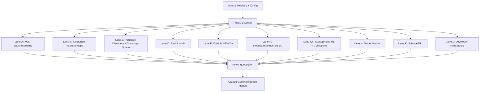

# X Distribution Intelligence Architecture Report

Generated: `2026-05-31T15:07:38.315311+00:00`
Latest queue timestamp: `2026-05-30T11:07:56.794479+00:00`

## Executive Audit

- Current level: fast creator / lightweight news-desk level for public AI intelligence. It is above a normal fast individual because it runs official blogs, X, Reddit, HN, YouTube, GitHub, Hugging Face, arXiv, finance, startup collections, model markets, and regional lanes together.
- Not Bloomberg level: no paid terminals, no proprietary reporter network, no direct company/source calls, no guaranteed real-time finance feed, and no legal/compliance editorial desk.
- Practical rating: `8/10` for public AI/news discovery, `7/10` for community/developer reality, `6/10` for global/regional coverage, `5.5/10` for finance depth, `8.5/10` for cost-effectiveness.
- Current bottleneck: XCLI is browser-automation-bound and is intentionally serialized because parallel X browser sessions caused Playwright context failures. The rest of the lanes run in parallel.

## Run Snapshot

- Queue items: `2059`
- Corporate announcements: `287`
- YouTube videos discovered in 2 days: `27` across `24` configured channels
- Transcript summary: `{'ok': 1, 'failed': 0, 'unavailable': 0, 'skipped': 26}`
- Reddit: `728` posts / `402` discoveries

## Lane Health

- `artifact_research`: OK / 106 items
- `community`: OK / 426 items
- `developer_sentiment`: OK / 33 items
- `finance`: OK / 126 items
- `model_market`: OK / 614 items
- `rss`: OK / 0 items
- `science`: OK / 98 items
- `startup_collections`: OK / 343 items
- `startup_funding`: OK / 29 items
- `x`: OK / 111 items
- `youtube`: OK / 0 items

## What Was Fixed

- Mistral moved from `https://mistral.ai/sitemap.xml` to `https://mistral.ai/sitemap-index.xml`; sitemap recursion now handles sitemap indexes.
- Moonshot/Kimi is no longer reported as unresolved; it is marked `MONITORED_ELSEWHERE` with configured fallback lanes.
- YouTube transcript pulling is queue-based, not channel-loop based. It only transcripts discovered videos, skips existing transcript files, and caches unavailable transcript videos.
- Julian Goldie SEO is disabled for now per instruction.
- X collection remains inside the full parallel system, but the XCLI worker itself is serialized because the local Playwright/XCLI stack is not concurrency-safe.
- Reddit MCP/RSS failures are fallback-safe; RSS rate limits are summarized rather than treated as broken source failures.
- arXiv now has API retry, RSS fallback, and cache preservation.
- Endpoints News 403 now falls back through search without crashing the science lane.
- Raw X posts are normalized before entering `news_queue.json`; schema validation is clean.

## Category Breakdown

### Bloomberg + Market-Moving AI

Count: `27`

Top sources: `Bloomberg Technology` (14), `Bloomberg Markets` (4), `StartupHub AI RSS` (2), `TLDR AI` (2), `Bloomberg @business · 6m` (1), `Bloomberg @business · 20m` (1)

- [Anthropic Valuation of $965 Billion Passes OpenAI](https://www.bloomberg.com/news/videos/2026-05-29/anthropic-valuation-of-965-billion-passes-openai-video) — `Bloomberg Technology` / `AI Market Intelligence`
- [Anthropic Raises at $965 Billion Valuation, Eclipsing OpenAI](https://www.bloomberg.com/news/videos/2026-05-29/anthropic-raises-at-965b-valuation-eclipsing-openai-video) — `Bloomberg Technology` / `AI Market Intelligence`
- [Huge AI Bonuses in South Korea Spark Fight Over Sharing Tech Wealth](https://www.bloomberg.com/news/features/2026-05-29/samsung-ai-bonuses-prompt-korea-debate-on-sharing-tech-wealth) — `Bloomberg Technology` / `AI Market Intelligence`
- [MiniMax Eyes China Listing, Takes on AI Rivals Like DeepSeek](https://www.bloomberg.com/news/articles/2026-05-30/minimax-plans-china-ipo-as-it-eyes-local-rivals-like-deepseek) — `Bloomberg Markets` / `AI Market Intelligence`
- [Wall Street Week | Britain’s Debt Problem, Poland’s Economic Boom](https://www.bloomberg.com/news/videos/2026-05-29/wall-street-week-britain-s-debt-problem-poland-s-boom-video) — `Bloomberg Markets` / `AI Market Intelligence`
- [BOE's Bailey Says UK Banks Don't Have Access to Mythos](https://www.bloomberg.com/news/videos/2026-05-29/boe-s-bailey-says-uk-banks-don-t-have-access-to-mythos-video) — `Bloomberg Technology` / `AI Market Intelligence`
- [SpaceX Lowers IPO Valuation Target | Bloomberg Tech 5/29/2026](https://www.bloomberg.com/news/videos/2026-05-29/bloomberg-tech-5-29-2026-video) — `Bloomberg Technology` / `AI Market Intelligence`
- [Gap Lowers Sales Outlook; Dell Soars on AI Demand | Stock Movers](https://www.bloomberg.com/news/videos/2026-05-29/gap-lowers-sales-outlook-dell-soars-on-ai-demand-video) — `Bloomberg Technology` / `AI Market Intelligence`

### New Models + Model Market

Count: `633`

Top sources: `OpenRouter` (336), `Fireworks Models` (80), `Groq Model Docs` (69), `Together Serverless Models` (65), `Replicate Language Models` (43), `Reddit r/OpenRouter` (16)

- [Anthropic: Claude Opus 4.8 (Fast)](https://openrouter.ai/anthropic/claude-opus-4.8-fast) — `OpenRouter` / `Model Market Signal`
- [Anthropic: Claude Opus 4.8](https://openrouter.ai/anthropic/claude-opus-4.8) — `OpenRouter` / `Model Market Signal`
- [Anthropic: Claude Opus 4.7 (Fast)](https://openrouter.ai/anthropic/claude-opus-4.7-fast) — `OpenRouter` / `Model Market Signal`
- [Anthropic: Claude Opus Latest](https://openrouter.ai/~anthropic/claude-opus-latest) — `OpenRouter` / `Model Market Signal`
- [Anthropic: Claude Opus 4.7](https://openrouter.ai/anthropic/claude-opus-4.7) — `OpenRouter` / `Model Market Signal`
- [Anthropic: Claude Opus 4.6 (Fast)](https://openrouter.ai/anthropic/claude-opus-4.6-fast) — `OpenRouter` / `Model Market Signal`
- [xAI: Grok 4.20 Multi-Agent](https://openrouter.ai/x-ai/grok-4.20-multi-agent) — `OpenRouter` / `Model Market Signal`
- [OpenAI: GPT-5.3-Codex](https://openrouter.ai/openai/gpt-5.3-codex) — `OpenRouter` / `Model Market Signal`

### Official Company Announcements

Count: `64`

Top sources: `e27 Southeast Asia Startups` (28), `TLDR AI` (22), `OpenAI News` (5), `Google AI Blog` (4), `xAI News` (3), `Anthropic News` (2)

- [Anthropic co-founder Chris Olah's remarks on Pope Leo XIV's encyclical "Magnifica humanitas" \ Anthropic](https://www.anthropic.com/news/chris-olah-pope-leo-encyclical) — `Anthropic News` / `Verified`
- [Boston Children’s uses AI to unlock new diagnoses](https://openai.com/index/boston-childrens-hospital) — `OpenAI News` / `Verified`
- [A shared playbook for trustworthy third party evaluations](https://openai.com/index/trustworthy-third-party-evaluations-foundations) — `OpenAI News` / `Verified`
- [OpenAI’s Frontier Governance Framework](https://openai.com/index/openai-frontier-governance-framework) — `OpenAI News` / `Verified`
- [Election information and safeguards in 2026](https://openai.com/index/election-safeguards-2026) — `OpenAI News` / `Verified`
- [Anthropic opens Milan office to support Italian enterprise, research, and developers \ Anthropic](https://www.anthropic.com/news/milan-office-opening) — `Anthropic News` / `Verified`
- [OpenAI, Grupo Folha and Grupo UOL announce strategic content partnership](https://openai.com/index/grupo-folha-grupo-uol-partnership) — `OpenAI News` / `Verified`
- [ElevenLabs Music Generation Model (3 minute read)](https://elevenlabs.io/blog/introducing-music-v2?utm_source=tldrai) — `TLDR AI` / `Verified`

### YouTube Deep Signals

Count: `31`

Top sources: `LexFridman` (6), `@OpenAI` (6), `AICodeKing` (3), `TBPNLive` (2), `@claude` (2), `@intheworldofai` (2)

- [Windows Computer Use and mobile access for Codex](https://www.youtube.com/watch?v=MPIAB-8VmCo) — `@OpenAI` / `Deep Signal`
- [Loblaw Ships Faster with Codex](https://www.youtube.com/watch?v=EYvzpZX2-Ww) — `@OpenAI` / `Deep Signal`
- [Build Hour: Agents SDK](https://www.youtube.com/watch?v=tK32trvj_b4) — `@OpenAI` / `Deep Signal`
- [YouTube Expands Automatic AI Video Labeling (1 minute read)](https://blog.youtube/news-and-events/improving-ai-labels-viewers-creators/?utm_source=tldrai) — `TLDR AI` / `Verified`
- [Builders Unscripted: Ep. 3 - Matias Castello, Product Leader at Alchemy](https://www.youtube.com/watch?v=8QKqENa_eQQ) — `@OpenAI` / `Deep Signal`
- [How Abridge uses GPT-5.5 for clinical decision support](https://www.youtube.com/watch?v=tXBRYPpIvms) — `@OpenAI` / `Deep Signal`
- [R&D Part 1](https://www.youtube.com/watch?v=DHfZqTWlSc4) — `@OpenAI` / `Deep Signal`
- [A developer in Hong Kong built a free app that turns your webcam into a 3D mode.  It's called SysMocap. Here is what it does.  You open your laptop. You point the webcam at yoursel](https://x.com/heynavtoor/status/2060670843311792303) — `Nav Toor @heynavtoor · 23m` / `High-Impact Rumor`

### X Watchlist + Fast Rumors

Count: `104`

Top sources: `Google DeepMind @GoogleDeepMind · May 26` (3), `Mustafa Suleyman @mustafasuleyman · May 27` (3), `xAI @xai · 18h` (3), `TBPN @tbpn · 10h` (3), `Google Gemini @GeminiApp · 13h` (3), `Anthropic @AnthropicAI · May 28` (2)

- [Windows users, this one’s for you.  Computer use now works on Windows, so Codex can take action on your Windows computer.  And with Windows support for Codex in the ChatGPT mobile](https://x.com/OpenAI/status/2060428604727771421) — `OpenAI @OpenAI · 16h` / `Verified`
- [New on the Engineering Blog: The access and permissions we grant agents should evolve with their capabilities. In our own products, we set these parameters through sandboxing, whic](https://x.com/AnthropicAI/status/2059351260243919269) — `Anthropic @AnthropicAI · May 27` / `Verified`
- [In conversation with OpenAI’s  @markchen90 , Terence reflects on a future where AI reduces the cognitive friction of research, helps preserve the paths behind discovery, and expand](https://x.com/OpenAI/status/2060451760033214653) — `OpenAI @OpenAI · 14h` / `Verified`
- [Earlier this month, our run-rate revenue crossed $47 billion.   This growth has been driven by organizations across many industries deploying Claude in their core operations, and b](https://x.com/AnthropicAI/status/2060061348818518493) — `Anthropic @AnthropicAI · May 28` / `Verified`
- [X post from Mistral AI @MistralAI · May 28](https://x.com/MistralAI/status/2059951141195075833) — `Mistral AI @MistralAI · May 28` / `Verified`
- [We're taking on the hardest problems in the real world    Today at The AI Now Summit, held at the Louvre, we announced AI solutions for aerospace, automotive, energy, and physics.](https://x.com/MistralAI/status/2059951137839616110) — `Mistral AI @MistralAI · May 28` / `Verified`
- [Before we ship a new model, these teams try to break it.  They build with it, push it to its limits, and tell us where it falls short. What they find makes the final model better.](https://x.com/claudeai/status/2060074627032838438) — `Claude @claudeai · May 29` / `Verified`
- [Claude Opus 4.8 is available today on the web, the Claude Platform, and all major cloud platforms.  Read more:](https://x.com/claudeai/status/2060045358445576332) — `Claude @claudeai · May 28` / `Verified`

### Reddit Community Reality

Count: `341`

Top sources: `Reddit r/ClaudeAI` (47), `Reddit r/OpenAI` (46), `Reddit r/AI_Agents` (45), `Reddit r/LocalLLaMA` (40), `Reddit r/ArtificialInteligence` (34), `Reddit r/MachineLearning` (20)

- [Which provider fits best for my needs?](https://www.reddit.com/r/OpenAI/comments/1tpebdc/which_provider_fits_best_for_my_needs/) — `Reddit r/OpenAI` / `Community Reality Check`
- [Complaint to OpenAI: Sabotage-Like Model Behavior During an Independent Mechanistic Interpretability Research Project](https://www.reddit.com/r/OpenAI/comments/1tqechj/complaint_to_openai_sabotagelike_model_behavior/) — `Reddit r/OpenAI` / `Community Reality Check`
- [Your Agents Are Aging Too: Agent Lifespan Engineering for Deployed Systems \[R\]](https://www.reddit.com/r/OpenAI/comments/1tqap7s/your_agents_are_aging_too_agent_lifespan/) — `Reddit r/OpenAI` / `Community Reality Check`
- [Testing Realtime 2 Voice API OpenAI.](https://www.reddit.com/r/OpenAI/comments/1tnjua3/testing_realtime_2_voice_api_openai/) — `Reddit r/OpenAI` / `Community Reality Check`
- [GPT-5.6 spotted in Codex](https://www.reddit.com/r/OpenAI/comments/1tr2ny5/gpt56_spotted_in_codex/) — `Reddit r/OpenAI` / `Community Reality Check`
- [How setup multiple accounts?](https://www.reddit.com/r/OpenAI/comments/1trdpxz/how_setup_multiple_accounts/) — `Reddit r/OpenAI` / `Community Reality Check`
- [First thing you see when Googling "OpenAI Codex app" is a fake malware website](https://www.reddit.com/r/OpenAI/comments/1tq4cql/first_thing_you_see_when_googling_openai_codex/) — `Reddit r/OpenAI` / `Community Reality Check`
- [Codex red dot errors?](https://www.reddit.com/r/OpenAI/comments/1tr3goe/codex_red_dot_errors/) — `Reddit r/OpenAI` / `Community Reality Check`

### Hacker News Developer Talk

Count: `24`

Top sources: `Hacker News` (24)

- [Claude Opus 4.8](https://www.anthropic.com/news/claude-opus-4-8) — `Hacker News` / `Community Reality Check`
- [Disagreement among frontier LLMs on real-world fact-checks](https://lenz.io/research/llm-disagreement) — `Hacker News` / `Community Reality Check`
- [Show HN: Continue? Y/N: A 60-second game about AI agent permission fatigue](https://llmgame.scalex.dev) — `Hacker News` / `Community Reality Check`
- [Various LLM Smells](https://shvbsle.in/various-llm-smells/) — `Hacker News` / `Community Reality Check`
- [Real-time LLM Inference on Standard GPUs: 3k tokens/s per request](https://blog.kog.ai/real-time-llm-inference-on-standard-gpus-3-000-tokens-s-per-request/) — `Hacker News` / `Community Reality Check`
- [Dynamic Workflows in Claude Code](https://claude.com/blog/introducing-dynamic-workflows-in-claude-code) — `Hacker News` / `Community Reality Check`
- [Robinhood now lets your AI agents trade stocks](https://techcrunch.com/2026/05/27/robinhood-now-lets-your-ai-agents-trade-stocks/) — `Hacker News` / `Community Reality Check`
- [Show HN: Zot – Yet another coding agent harness](https://www.zot.sh) — `Hacker News` / `Community Reality Check`

### Startup Funding

Count: `20`

Top sources: `TLDR All` (4), `CNBC Technology` (2), `TLDR AI` (2), `TechCrunch Startups` (2), `e27` (2), `Crunchbase AI` (2)

- [Anthropic raises $65B in Series H funding at $965B post-money valuation \ Anthropic](https://www.anthropic.com/news/series-h) — `Anthropic News` / `Verified`
- [How Meta is looking for revenue outside advertising to justify its ballooning capex bill (4 minute read)](https://sherwood.news/tech/meta-looks-to-enterprise-cloud-subscriptions-to-justify-ballooning-capex-bill/?utm_source=tldrnewsletter) — `TLDR All` / `AI Market Intelligence`
- [Anthropic Raised $65B in Series H Funding (2 minute read)](https://www.anthropic.com/news/series-h?utm_source=tldrai) — `TLDR All` / `AI Market Intelligence`
- [More Devins in More Places (3 minute read)](https://cognition.ai/blog/series-d?utm_source=tldrai) — `TLDR AI` / `AI Market Intelligence`
- [Agent Judge: Solving Long-Context Evals for Production Agents (10 minute read)](https://www.judgmentlabs.ai/blogs/agent-judge-solving-long-context-evaluations?utm_source=tldrai) — `TLDR All` / `AI Market Intelligence`
- [OpenRouter more than doubles valuation to $1.3B in a year (2 minute read)](https://techcrunch.com/2026/05/26/openrouter-more-than-doubles-valuation-to-1-3b-in-a-year/?utm_source=tldrai) — `TLDR AI` / `Verified`
- [Anthropic tops OpenAI as most valuable AI startup, nears $1 trillion valuation in latest round](https://www.cnbc.com/2026/05/28/anthropic-open-ai-startup-value.html) — `CNBC Technology` / `AI Market Intelligence`
- [Anthropic nears $1 trillion valuation in latest round (4 minute read)](https://www.cnbc.com/2026/05/28/anthropic-open-ai-startup-value.html?utm_source=tldrnewsletter) — `TLDR All` / `AI Market Intelligence`

### Startup Collections + Missed Startups

Count: `201`

Top sources: `TrustMRR API` (104), `FundBat Companies` (38), `StartupHub AI RSS` (33), `NeuronFeed` (17), `The Watchlist Alerts` (6), `CB Insights Research` (2)

- [Parallel Drive Parallel Drive is an AI-first software studio building software agents battle tested with real production client work. Revenue (30d) $300 MRR $0 Total $920k](https://trustmrr.com/startup/parallel-drive) — `TrustMRR API` / `Funded Startup Signal`
- [Anthropic US AI safety lab building Claude — a helpful, harmless, honest AI assistant. Raised $67.6B Stage S-G 83](https://neuronfeed.com/startups/anthropic) — `NeuronFeed` / `Funded Startup Signal`
- [OpenAI US Creator of ChatGPT, GPT-4, and the leading frontier AI lab. Raised $193.3B Stage S-E 81](https://neuronfeed.com/startups/openai) — `NeuronFeed` / `Funded Startup Signal`
- [Harvey US The AI platform for elite law firms. Raised $1.5B Stage S-F 81](https://neuronfeed.com/startups/harvey) — `NeuronFeed` / `Funded Startup Signal`
- [Perplexity US AI-powered answer engine delivering real-time, cited responses to complex queries. Raised $2.0B Stage S-F 79](https://neuronfeed.com/startups/perplexity) — `NeuronFeed` / `Funded Startup Signal`
- [Polymarket Volume Breakdown](https://www.startuphub.ai/ai-news/prediction-markets/2026/polymarket-volume-breakdown) — `StartupHub AI RSS` / `Funded Startup Signal`
- [AI Shakeup: Anthropic's $96.5B Valuation Overtakes OpenAI](https://www.startuphub.ai/ai-news/funding-round/2026/ai-shakeup-anthropic-s-96-5b-valuation-overtakes-openai) — `StartupHub AI RSS` / `Funded Startup Signal`
- [Yann LeCun's AMI Labs Raises $1.03B to Build Beyond LLMs](https://www.startuphub.ai/ai-news/ai-figures/2026/figure-yann-lecun-ami-labs-company-breakdown-2026-05-29) — `StartupHub AI RSS` / `Funded Startup Signal`

### China + Regional AI

Count: `103`

Top sources: `36Kr China Startups` (30), `Pandaily China Tech` (13), `LatePost` (11), `TechNode China Tech` (11), `QbitAI China AI` (10), `NeuronFeed` (8)

- [海光信息完成阶跃星辰Step 3.7 Flash适配](https://36kr.com/newsflashes/3831356538529409?f=rss) — `36Kr China Startups` / `Verified`
- [CATL launches world’s largest energy storage testbed in Xiamen](https://technode.com/2026/05/29/catl-launches-worlds-largest-energy-storage-testbed-in-xiamen/) — `TechNode China Tech` / `Verified`
- [BYD launches Xuanji A3, calls it China’s first 4nm smart driving chip](https://technode.com/2026/05/29/byd-launches-xuanji-a3-calls-it-chinas-first-4nm-smart-driving-chip/) — `TechNode China Tech` / `Verified`
- [Stepfun Open-Sources Step 3.7 Flash LLM Optimized for Agent Era](https://pandaily.com/stepfun-open-source-step-3-7-flash-llm-agent-may2026) — `Pandaily China Tech` / `Verified`
- [Tencent Expands Its Global AI Footprint with the Debut of Its Productivity AI Agent](https://pandaily.com/tencent-expands-its-global-ai-footprint-with-the-debut-of-its-productivity-ai-agent) — `Pandaily China Tech` / `Verified`
- [MediaTek could partner with Tesla’s TERAFAB, expected to produce chips by 2028](https://technode.com/2026/05/28/mediatek-could-partner-with-teslas-terafab-expected-to-produce-chips-for-tesla-by-2028/) — `TechNode China Tech` / `Verified`
- [RoboMemArena: New Benchmark Systematically Evaluates Robot Memory Capabilities](https://pandaily.com/robomemarena-robot-memory-benchmark-may2026) — `Pandaily China Tech` / `Verified`
- [Tencent's Toast App Lets Anyone Build Native Mobile Apps with Natural Language](https://pandaily.com/tencent-toast-vibecoding-app-may2026) — `Pandaily China Tech` / `Verified`

### India Deep-Tech

Count: `91`

Top sources: `Entrackr` (34), `Analytics India Deep Tech` (16), `YourStory India Startups` (15), `Medianama India Tech Policy` (7), `Economic Times AI` (5), `Inc42 AI India` (4)

- [From Search Engines to Autonomous Agents: AI industry enters its next phase](https://economictimes.indiatimes.com/ai/ai-insights/from-search-engines-to-autonomous-agents-ai-industry-enters-its-next-phase/articleshow/131346643.cms) — `Economic Times AI` / `AI Market Intelligence`
- [Anthropic Surpasses OpenAI With $965 Bn Valuation, Launches Claude Opus 4.8](https://analyticsindiamag.com/ai-news/anthropic-surpasses-openai-with-965-bn-valuation-launches-claude-opus-48) — `Analytics India Deep Tech` / `Funded Startup Signal`
- [MapmyIndia replaces Google Maps in Amazon Now, launches AI address verification for banks: Q4FY26](https://www.medianama.com/2026/05/223-mapmyindia-q4fy26-amazon-now-integrates-mappls-apis/) — `Medianama India Tech Policy` / `Verified`
- [IISc launches Wadhwani Innovation Centre in Bengaluru to boost quantum and deeptech ecosystem](https://yourstory.com/2026/05/iisc-wadhwani-innovation-centre-bengaluru-quantum-deeptech-ecosystem) — `YourStory India Startups` / `Verified`
- [Exit Is the Primary Agentic Right](https://www.medianama.com/2026/05/223-ai-agent-authority-after-permission-expires/) — `Medianama India Tech Policy` / `Verified`
- [Red Balloon Aerospace launches stratospheric pressure balloon](https://yourstory.com/2026/05/red-balloon-aerospace-launches-stratospheric-pressure-balloon) — `YourStory India Startups` / `Verified`
- [US stock markets today (May 30, 2026): S&P 500, Nasdaq extend record run as Dell jumps 33% on AI demand](https://timesofindia.indiatimes.com/business/international-business/us-stock-markets-today-may-29-2026-sp-500-nasdaq-extend-record-run-as-dell-jumps-33-on-ai-demand/articleshow/131393106.cms) — `Times of India Business` / `AI Market Intelligence`
- [As AI Adoption Accelerates in India, Mumbai Emerges as a Key Technology Hub](https://economictimes.indiatimes.com/ai/ai-insights/as-ai-adoption-accelerates-in-india-mumbai-emerges-as-a-key-technology-hub/articleshow/131373252.cms) — `Economic Times AI` / `AI Market Intelligence`

### Bio + Science Breakthroughs

Count: `103`

Top sources: `Fierce Biotech` (25), `SynBioBeta` (21), `STAT News` (20), `BioPharma Dive` (10), `Genetic Engineering and Biotechnology News` (8), `Nature Biotechnology` (8)

- [Verge, following trial failure, rebrands its AI drug discovery ambitions](https://www.biopharmadive.com/news/verge-genomics-labs-neuroscience-AI-drug-discovery/821229/) — `BioPharma Dive` / `Science/Deep-Tech Breakthrough`
- [Scoring gene importance by interpreting single-cell foundation models](https://www.nature.com/articles/s41587-026-03112-5) — `Nature Biotechnology` / `Science/Deep-Tech Breakthrough`
- [Accurate quantification in proteomics with QuantUMS](https://www.nature.com/articles/s41587-026-03131-2) — `Nature Biotechnology` / `Science/Deep-Tech Breakthrough`
- [Programming biology: next-gen AI firms raise billions to design better medicines](https://www.nature.com/articles/s41587-026-03170-9) — `Nature Biotechnology` / `Science/Deep-Tech Breakthrough`
- [Announcing the SOSV Deep Tech Summit, coming November 4-6](https://sosv.com/announcing-the-sosv-deep-tech-summit-coming-november-4-6/) — `SOSV` / `Science/Deep-Tech Breakthrough`
- [STAT+: At ASCO, positive data for Bristol in multiple myeloma and Pfizer in lung cancer](https://www.statnews.com/2026/05/29/asco-news-day-1-multiple-myeloma-bristol-lung-cancer-pfizer/?utm_campaign=rss) — `STAT News` / `Science/Deep-Tech Breakthrough`
- [Improving multimodal wearable sensing for healthcare with artificial intelligence](https://www.nature.com/articles/s41587-026-03134-z) — `Nature Biotechnology` / `Science/Deep-Tech Breakthrough`
- [A framework for building a synthetic cell from the SynCell Asia Initiative](https://www.nature.com/articles/s41587-026-03153-w) — `Nature Biotechnology` / `Science/Deep-Tech Breakthrough`

### GitHub / Hugging Face / arXiv Artifacts

Count: `201`

Top sources: `Hugging Face` (61), `ArXiv` (40), `TrustMRR API` (29), `NeuronFeed` (15), `TLDR AI` (14), `Dealroom Reports` (12)

- [MiniMax teases upcoming M3 model with new sparse attention mechanism and 15.6X long-context response speed boost (12 minute read)](https://venturebeat.com/technology/minimax-teases-upcoming-m3-model-with-new-sparse-attention-mechanism-and-15-6x-response-speed-boost?utm_source=tldrai) — `TLDR AI` / `AI Market Intelligence`
- [OpenAI Published a Frontier Governance Framework (4 minute read)](https://openai.com/index/openai-frontier-governance-framework/?utm_source=tldrai) — `TLDR AI` / `AI Market Intelligence`
- [Microsoft tries to get back in the AI coding game with new model (1 minute read)](https://sherwood.news/tech/report-microsoft-tries-to-get-back-in-the-ai-coding-game-with-new-model/?utm_source=tldrai) — `TLDR All` / `AI Market Intelligence`
- [Anthropic's $965B Valuation Outshines OpenAI](https://www.startuphub.ai/ai-news/funding-round/2026/anthropic-s-965b-valuation-outshines-openai) — `StartupHub AI RSS` / `Funded Startup Signal`
- [Xiaomi’s Q1 EV deliveries surpass 80,000 units](https://technode.com/2026/05/27/xiaomis-q1-ev-deliveries-surpass-80000-units/) — `TechNode China Tech` / `Verified`
- [The moat is no longer the model, it is the memory](https://e27.co/the-moat-is-no-longer-the-model-it-is-the-memory-20260523/) — `e27 Southeast Asia Startups` / `Verified`
- [5 out of 6 of orgs don't have the data foundation for agentic AI... (Sponsor)](https://www.fivetran.com/resources/reports/the-2026-agentic-ai-readiness-index?utm_source=TLDR&amp;utm_medium=newsletter&amp;utm_campaign=2026-05-22_Primary_+Fivetran&amp;utm_content=header_5_out_6) — `TLDR AI` / `Verified`
- [Reasonix (Website)](https://esengine.github.io/DeepSeek-Reasonix/?utm_source=tldrai) — `TLDR AI` / `Verified`

### Developer Pain + Provider Status

Count: `33`

Top sources: `OpenAI Status` (10), `Anthropic Status` (8), `Together Status` (5), `Groq Status` (3), `Fireworks Status` (3), `TLDR AI` (2)

- [Gemini 3.5 Flash Looks Good For How Fast It Is (8 minute read)](https://thezvi.wordpress.com/2026/05/22/gemini-3-5-flash-looks-good-for-how-fast-it-is/?utm_source=tldrai) — `TLDR AI` / `Verified`
- [Users May Experience Issues Accessing ChatGPT](https://status.openai.com//incidents/01KSSY9D28AM92BCDXRTS4CDKZ) — `OpenAI Status` / `Developer Pain/Adoption Signal`
- [Codex Context Compaction Latency](https://status.openai.com//incidents/01KSN9ATSF1WCJ5ZTQSR1H9CC7) — `OpenAI Status` / `Developer Pain/Adoption Signal`
- [Subscription checkout failing](https://status.openai.com//incidents/01KSPYYC11CCY3KKXEK4E03CBG) — `OpenAI Status` / `Developer Pain/Adoption Signal`
- [Elevated errors for Claude Opus 4.8](https://status.claude.com/incidents/2zr0rkdxjdtc) — `Anthropic Status` / `Developer Pain/Adoption Signal`
- [Elevated errors on Claude Opus 4.8](https://status.claude.com/incidents/5s24h0pbdj5d) — `Anthropic Status` / `Developer Pain/Adoption Signal`
- [Elevated errors on Claude Opus 4.7](https://status.claude.com/incidents/0w1bqsc12lt8) — `Anthropic Status` / `Developer Pain/Adoption Signal`
- [Elevated errors on Claude Opus 4.7](https://status.claude.com/incidents/rtr7z82cqmp9) — `Anthropic Status` / `Developer Pain/Adoption Signal`

### Product Launch Radar

Count: `18`

Top sources: `TLDR AI` (8), `Product Hunt` (5), `TLDR All` (1), `e27` (1), `OpenAI News` (1), `NVIDIA Blog` (1)

- [Strengthening societal resilience with Rosalind Biodefense](https://openai.com/index/strengthening-societal-resilience-with-rosalind-biodefense) — `OpenAI News` / `Verified`
- [The Name’s Gaming … Cloud Gaming: ‘007 First Light’ Launches on GeForce NOW](https://blogs.nvidia.com/blog/geforce-now-thursday-007-first-light-launch/) — `NVIDIA Blog` / `Verified`
- [We are working faster than ever, so why are we more mentally exhausted?](https://e27.co/we-are-working-faster-than-ever-so-why-are-we-more-mentally-exhausted-20260527/) — `e27 Southeast Asia Startups` / `Verified`
- [Building self-improving tax agents with Codex (17 minute read)](https://openai.com/index/building-self-improving-tax-agents-with-codex/?utm_source=tldrai) — `TLDR AI` / `Verified`
- [Former Google and Apple researchers launch Trajectory to enhance AI feedback loops (3 minute read)](https://cryptobriefing.com/trajectory-ai-startup-google-apple-researchers/?utm_source=tldrai) — `TLDR AI` / `Verified`
- [MAI-Image-2.5 launches at No. 3 on Arena (1 minute read)](https://microsoft.ai/news/mai-image-2-5-launches-at-no-3-on-arena-ai/?utm_source=tldrai) — `TLDR AI` / `Verified`
- [Introducing Grok Build (3 minute read)](https://x.ai/news/grok-build-cli?utm_source=tldrai) — `TLDR AI` / `Verified`
- [The 2026-07-28 MCP Specification Release Candidate (9 minute read)](https://blog.modelcontextprotocol.io/posts/2026-07-28-release-candidate/?utm_source=tldrai) — `TLDR AI` / `Verified`

### Workflow / Agents / Coding

Count: `45`

Top sources: `TLDR AI` (24), `OpenAI News` (6), `Mistral AI News` (6), `e27 Southeast Asia Startups` (4), `NVIDIA Blog` (2), `CNBC Technology` (1)

- [How Braintrust turns customer requests into code with Codex](https://openai.com/index/braintrust) — `OpenAI News` / `Verified`
- [How Endava builds an agentic organization with Codex](https://openai.com/index/endava) — `OpenAI News` / `Verified`
- [Frontier AI LLMs, assistants, agents, services](https://mistral.ai/news/) — `Mistral AI News` / `Verified`
- [AI Now Summit 2026](https://mistral.ai/news/ai-now-summit-2026/) — `Mistral AI News` / `Verified`
- [Introducing Search Toolkit](https://mistral.ai/news/search-toolkit/) — `Mistral AI News` / `Verified`
- [Vibe gets to work.](https://mistral.ai/news/vibe-agent/) — `Mistral AI News` / `Verified`
- [Cisco and OpenAI redefine enterprise engineering with Codex](https://openai.com/index/cisco) — `OpenAI News` / `Verified`
- [Building self-improving tax agents with Codex](https://openai.com/index/building-self-improving-tax-agents-with-codex) — `OpenAI News` / `Verified`

### Finance / Macro / Chips

Count: `20`

Top sources: `CNBC Technology` (7), `TLDR AI` (6), `e27 Southeast Asia Startups` (4), `SEC EDGAR META` (1), `TLDR All` (1), `Anthropic News` (1)

- [Anthropic appoints KiYoung Choi as Representative Director of Korea \ Anthropic](https://www.anthropic.com/news/kiyoung-choi-representative-director-anthropic-korea) — `Anthropic News` / `Verified`
- [Meta 8-K filing](https://www.sec.gov/Archives/edgar/data/1326801/000162828026039193/meta-20260527.htm) — `SEC EDGAR META` / `AI Market Intelligence`
- [Jim Cramer says Dell’s blowout quarter sets up a crucial week for AI stocks](https://www.cnbc.com/2026/05/29/jim-cramer-says-dells-blowout-quarter-sets-up-a-crucial-week-for-ai-stocks.html) — `CNBC Technology` / `AI Market Intelligence`
- [Samsung's shares surge as much as 6% after company ships next-generation AI memory chip samples](https://www.cnbc.com/2026/05/29/samsung-hbm4e-chip-samples-ai-memory.html) — `CNBC Technology` / `AI Market Intelligence`
- [Nvidia is investing billions into this emerging technology that could change the AI industry](https://www.cnbc.com/2026/05/29/nvidia-photonics-investment-ai.html) — `CNBC Technology` / `AI Market Intelligence`
- [IBM rallies after committing to spend $10 billion to pursue the holy grail of quantum computing (2 minute read)](https://sherwood.news/markets/ibm-quantum-computing-10-billion-investment-government-support/?utm_source=tldrnewsletter) — `TLDR All` / `AI Market Intelligence`
- [Software stocks wrap up best month since 2001 as talk of 'SaaSpocalypse' subsides](https://www.cnbc.com/2026/05/29/software-stocks-wrap-best-month-since-2001-as-talk-of-saaspocalypse-.html) — `CNBC Technology` / `AI Market Intelligence`
- [Tokens or humans? The new corporate trade-off](https://www.cnbc.com/2026/05/29/-tokens-or-humans-the-new-corporate-trade-off.html) — `CNBC Technology` / `AI Market Intelligence`

## Architecture Map

## Next Architecture Priorities

1. Split X collection into an authenticated persistent browser service with an internal queue, instead of launching independent CLI browser sessions.
2. Add source-health scoring over time so failing/noisy sources are visible without blocking the collection run.
3. Add newsletter inbox ingestion for TLDR/Bloomberg-style newsletters and private email sources.
4. Add editorial ranking with cross-source corroboration: official + community + artifact + model-market.
5. Add regional source packs for China, India, EU, Israel, and Southeast Asia with per-locale translation/summarization.
