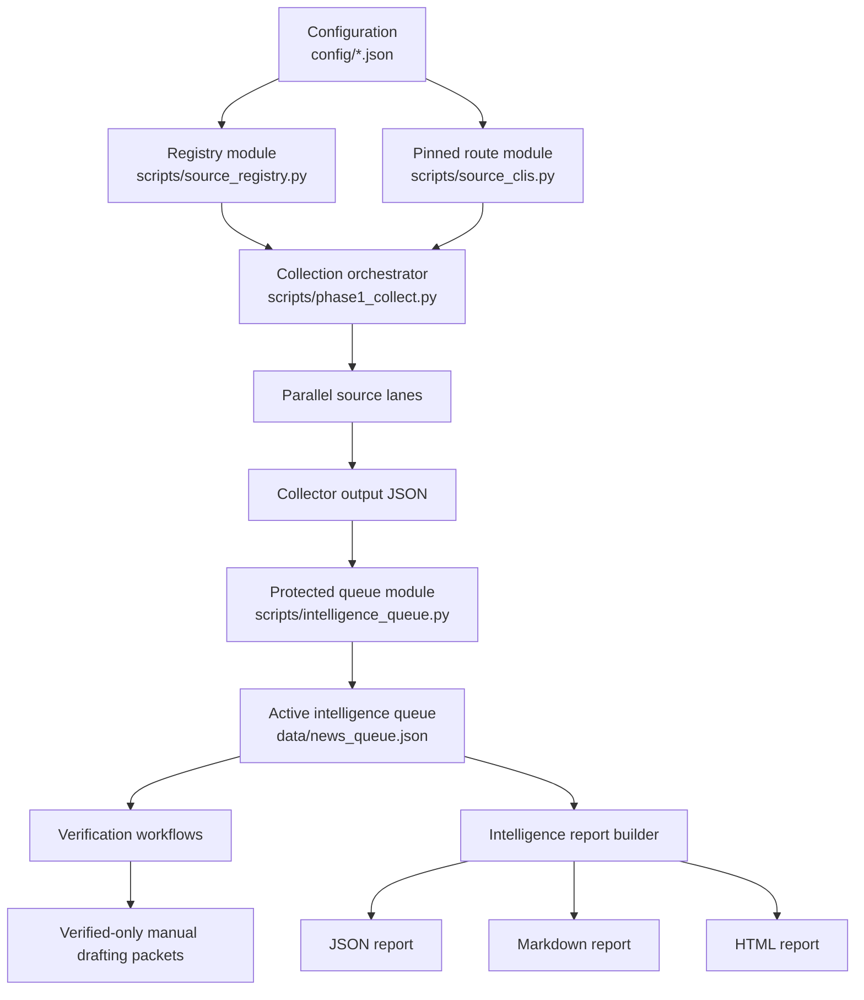

# X Distribution Architecture Guide

Updated: 2026-05-31

## 1. Purpose

X Distribution is a local public-signal intelligence desk. Its job is to reduce the distance between a heterogeneous source landscape and a reviewable editorial queue.

The system performs five jobs:

1. Collect public AI and technology signals from independent source lanes.
2. Preserve source-specific evidence and health diagnostics.
3. Normalize recent signals into the protected active intelligence queue.
4. Generate categorized intelligence views for human review.
5. Prepare verified-only manual editorial drafting packets.

It intentionally does not automate X publishing or replies.

## 2. Domain Vocabulary

| Term | Meaning |
|---|---|
| Intelligence desk | The complete local system |
| Source lane | A configured collection path for one evidence family |
| Collector output | A source-specific JSON artifact written by a source lane |
| Active intelligence queue | Protected `data/news_queue.json` state for reporting, verification, and editorial work |
| Intelligence report | A disposable categorized view derived from the queue |
| Protected state | High-value local state that must not be casually overwritten or deleted |
| Editorial workflow | Verification and manual content preparation downstream of collection |

The canonical glossary lives in [`CONTEXT.md`](../CONTEXT.md).

## 3. Layered Architecture



### Layer A: Configuration

Configuration lives under `config/`. Source lists belong in JSON files, not scattered through scripts.

| File | Responsibility |
|---|---|
| `config/source_registry.json` | Live lane enablement, script outputs, queue policy, pinned route paths, artifact watchlists, cleanup policy |
| `config/source_tiers.json` | Trusted source tiers and quarantine rules |
| `config/community_sources.json` | Reddit and Hacker News communities, keywords, fallback settings |
| `config/corporate_blogs.json` | Official blogs, RSS endpoints, sitemaps, regional sources |
| `config/finance_sources.json` | Market, macro, newsletter, SEC, and finance filters |
| `config/startup_sources.json` | Startup funding, product, and regional feeds |
| `config/startup_collection_sources.json` | Directory-style startup discovery |
| `config/model_market_sources.json` | Model-market source policy |
| `config/science_sources.json` | Science and deep-tech sources |
| `config/developer_sentiment_sources.json` | Provider status and developer-pain sources |
| `config/youtube_channels.json` | YouTube channel IDs |
| `config/youtube_channel_profiles.json` | YouTube priority and transcript policy |
| `config/followed_accounts.json` | X watchlist |

### Layer B: Route Enforcement

`scripts/source_clis.py` is the canonical route module for machine-specific integrations:

- X collection uses the pinned local XCLI.
- YouTube transcript retrieval uses the pinned global YT Transcript CLI.
- Workspace Python scripts run through the configured interpreter.

Environment overrides:

| Variable | Purpose |
|---|---|
| `X_DISTRIBUTION_ROOT` | Alternate workspace root |
| `X_DISTRIBUTION_PYTHON` | Python interpreter |
| `XCLI_SCRIPT` | XCLI script |
| `YT_TRANSCRIPT_CLI` | Global YouTube transcript command |
| `YT_TRANSCRIPT_PY_SCRIPT` | Importable Python implementation behind the transcript CLI |

### Layer C: Parallel Collection

`scripts/phase1_collect.py` runs source lanes concurrently with a configurable worker cap. X account collection has a separate internal worker policy because the browser-backed X route is not concurrency-safe.

| Lane | Collector behavior | Queue contribution |
|---|---|---|
| X | Home feed plus watched timelines | Direct normalized items |
| RSS | Corporate and regional feeds | Reread from `data/corporate_announcements.json` |
| YouTube | Channel discovery and transcript queue | Reread from `data/new_videos_queue.json` |
| Community | Reddit and Hacker News | Normalized community discussion items |
| Artifact research | GitHub, Hugging Face, arXiv | Normalized artifact and paper items |
| Finance | Market, macro, newsletter, SEC | Filtered finance signals |
| Startup funding | Funding and product feeds | Filtered funding and launch signals |
| Model market | OpenRouter model radar | Model catalog and market signals |
| Startup collections | Directory and fallback discovery | Missed-startup signals |
| Science | Bio, science, deep tech | Breakthrough signals |
| Developer sentiment | Provider health and developer pain | Status and adoption signals |

Lane health is written to `data/phase1_lane_health.json`.

### Layer D: Protected Queue

`scripts/intelligence_queue.py` is the authoritative module for `data/news_queue.json`.

Its interface provides:

- historical list-shape compatibility
- URL canonicalization
- stable item identity
- duplicate provenance merging
- recency filtering
- queue metadata construction
- atomic JSON replacement
- replacement and merge operations

Atomic replacement matters because the active queue is shared protected state. An interrupted canonical write leaves the previous complete file intact.

Queue document shape:

```json
{
  "metadata": {
    "description": "Active intelligence queue aggregated from configured source registry outputs",
    "max_items_kept": 1000,
    "dedupe": "canonical_url"
  },
  "last_updated": "ISO timestamp",
  "total_items": 0,
  "items": []
}
```

### Layer E: Reports

`scripts/build_intelligence_report.py` reads the active intelligence queue and creates categorized views:

- `data/exports/reports/latest-intelligence-categories.json`
- `data/exports/reports/x-distribution-intelligence-architecture-report.md`
- `data/exports/reports/x-distribution-intelligence-architecture-report.html`

The report builder classifies signals into categories such as model market, company announcements, community reality, startup funding, regional AI, artifacts, developer pain, workflow tooling, finance, and chips.

Reports are derived views. They can be regenerated; the active intelligence queue remains authoritative.

### Layer F: Verification And Editorial Work

The documented verification protocol lives in `references/fact-checking.md`. It covers source credibility, claim verification, recency, missing context, and conflicts of interest.

`scripts/generated_codegen.py` now prepares only empty manual drafting packets for items carrying `VERIFIED` or `LIKELY_TRUE`. This prevents the editorial route from inventing publishable claims.

Approved packet shape:

```json
{
  "metadata": {
    "description": "Verified-only manual X drafting packets",
    "publishing": "manual_copy_only"
  },
  "total_items": 0,
  "items": []
}
```

## 4. Source-Specific Evidence

Collector outputs preserve the latest source run. They are not interchangeable with the queue.

| Evidence family | Important files |
|---|---|
| X | `data/x_raw_standalone.json`, `data/x_radar_standalone.json` |
| YouTube | `data/new_videos_queue.json`, `data/transcripts/`, `data/mass_transcript_pool.json` |
| Community | `data/reddit_raw_standalone.json`, `data/hn_raw_standalone.json` |
| Official and regional news | `data/corporate_announcements.json` |
| Artifacts | `data/github_discoveries.json`, `data/release_discoveries.json`, `data/hf_discoveries.json` |
| Research | `data/arxiv_raw_standalone.json` |
| Finance | `data/finance_raw_standalone.json`, `data/finance_signals.json` |
| Startups | `data/startup_funding_raw.json`, `data/startup_funding_signals.json`, `data/startup_collections_signals.json` |
| Model market | `data/model_market_raw.json`, `data/model_market_signals.json` |
| Science | `data/science_breakthrough_signals.json` |
| Developer sentiment | `data/developer_sentiment_signals.json` |

Collector history files such as `data/github_history.json` preserve dedupe memory. Deleting history causes rediscovery.

## 5. Operator CLI

The master operator interface is `scripts/x_distribution.py`.

| Command | Behavior | Mutates protected state? |
|---|---|---|
| `routes` | Check pinned XCLI and transcript routes | No |
| `validate` | Validate critical config and data schemas | No |
| `collect --verify-only` | Print configured collectors and outputs | Writes harness verification evidence only |
| `collect` | Run full Phase 1 collection | Yes: replaces active queue atomically |
| `normalize` | Canonicalize, dedupe, rank, and cap queue | Yes: replaces active queue atomically |
| `storage-check` | Ensure target layout and manifest | Writes layout markers and manifest |
| `verify` | Run route and schema checks | Writes harness verification evidence |
| `generate-posts` | Prepare verified-only manual drafting packets | Writes `data/approved_posts.json` |
| `cleanup` | Dry-run stale file audit | Writes audit manifest |
| `cleanup --apply` | Archive stale candidates | Moves only configured stale files |

## 6. Safe Operating Sequences

### Health check

```powershell
$py = "C:\Users\Manit\AppData\Local\Programs\Python\Python311\python.exe"
& $py scripts\x_distribution.py routes
& $py scripts\x_distribution.py validate
& $py scripts\x_distribution.py collect --verify-only
```

### Full collection and report refresh

```powershell
$py = "C:\Users\Manit\AppData\Local\Programs\Python\Python311\python.exe"
& $py scripts\x_distribution.py collect
& $py scripts\x_distribution.py normalize
& $py scripts\build_intelligence_report.py
```

### Editorial preparation

```powershell
$py = "C:\Users\Manit\AppData\Local\Programs\Python\Python311\python.exe"
& $py scripts\x_distribution.py generate-posts
```

This intentionally produces no drafting packets until fact-check verdicts exist.

### Safe cleanup

```powershell
$py = "C:\Users\Manit\AppData\Local\Programs\Python\Python311\python.exe"
& $py scripts\archive_stale_files.py
# Review cache/stale_file_audit.json first.
& $py scripts\archive_stale_files.py --apply
```

## 7. Verification Surface

The architecture is verified through interfaces, not by inspecting implementation alone.

| Check | Proves |
|---|---|
| `scripts/test_intelligence_queue.py` | URL identity, provenance merge, legacy reads, queue merge, recency filtering |
| `scripts/test_post_generation.py` | Verified-only editorial eligibility and empty manual drafts |
| `scripts/validate_schemas.py` | Critical JSON shape checks |
| `scripts/source_clis.py` | Pinned X and YouTube routes exist and execute help commands |
| `scripts/x_distribution.py collect --verify-only` | Registry exposes configured live collectors and outputs |
| Python compile check | Edited scripts parse |

## 8. Storage Rules

Practical storage classes:

| Class | Meaning | Deletion rule |
|---|---|---|
| Canonical data | Current source of truth | Do not delete |
| Raw collector output | Latest evidence from a source lane | Preserve or archive after replacement |
| Cache and ledger | Verification and dedupe memory | Preserve unless intentionally resetting state |
| Generated scratch | Temporary or diagnostic artifacts | Archive before deletion |

The full guide is [`references/data-storage.md`](../references/data-storage.md).

## 9. Compatibility And Legacy

This workspace grew through multiple generations of collection and editorial experiments. Some scripts remain for compatibility or diagnostics.

Important distinctions:

- `scripts/phase1_collect.py` is the canonical full collection orchestrator.
- `scripts/intelligence_queue.py` is the canonical active-queue seam.
- `scripts/source_clis.py` is the canonical X and YouTube route module.
- `scripts/process_news.py` is intentionally disabled because its historical implementation embedded prototype stories.
- `scripts/generated_codegen.py` is safe packet preparation, not an autonomous copywriter.
- `system-snapshot/` is historical reference and must remain untouched unless explicitly removed.

Use [`references/script-inventory.md`](../references/script-inventory.md) before running unfamiliar scripts.

## 10. Known Limitations

1. Raw, normalized, and generated artifacts still coexist under `data/`.
2. Full live collection depends on public network surfaces and can be slow.
3. XCLI remains authenticated-browser-backed and internally serialized.
4. Reddit direct JSON can return `403`; RSS fallback is the practical route.
5. Public market and startup sources are not substitutes for paid terminals or private databases.
6. Report classification is heuristic and belongs in a derived view.
7. The verification protocol is documented more deeply than it is automated.
8. Historical compatibility scripts remain and should be migrated or retired deliberately.

## 11. Next Architecture Priorities

1. Move remaining compatibility readers and writers behind dedicated modules or mark them retired.
2. Introduce dual-write compatibility shims for `data/raw/`, `data/normalized/`, `data/verified/`, and `data/content/`.
3. Add source-health history and trend reporting rather than per-run snapshots only.
4. Add automated cross-source story clustering with evidence confidence.
5. Promote fact-check results into a durable verified-claims ledger.
6. Add report-generation and CLI integration tests.

## 12. Decision Records

- [`docs/adr/0001-protected-intelligence-queue-seam.md`](adr/0001-protected-intelligence-queue-seam.md)
- [`.harness/DECISIONS.md`](../.harness/DECISIONS.md)
- [`CONTEXT.md`](../CONTEXT.md)

